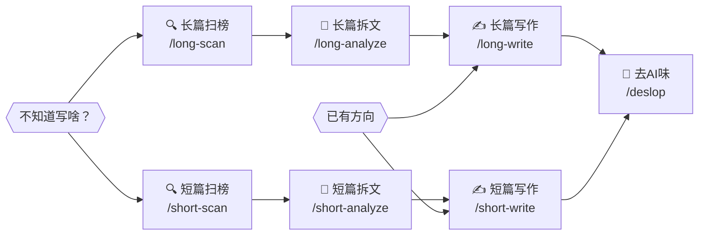

# oh-story-claudecode

网文写作 skill 包，覆盖长篇与短篇网文的扫榜、拆文、写作、去AI味全流程。

## 流程总览



## 安装

```bash
npx skills add worldwonderer/oh-story-claudecode
```

更新时重新执行同一条命令即可。

## Skills

| Skill | 触发 | 说明 |
|:------|:-----|:-----|
| `story-long-write` | `/story-long-write` `/story` `/网文` | 长篇写作 · 大纲搭建、人物设定、正文输出 |
| `story-long-analyze` | `/story-long-analyze` | 长篇拆文 · 黄金三章、爽点设计、节奏分析 |
| `story-long-scan` | `/story-long-scan` | 长篇扫榜 · 起点/番茄/晋江市场趋势 |
| `story-short-write` | `/story-short-write` | 短篇写作 · 情绪设计、反转构思、精修出稿 |
| `story-short-analyze` | `/story-short-analyze` | 短篇拆文 · 叙事结构、情绪曲线、钩子拆解 |
| `story-short-scan` | `/story-short-scan` | 短篇扫榜 · 知乎盐言/番茄短篇风口数据 |
| `story-deslop` | `/story-deslop` `/去AI味` | 去AI味 · 检测并清除 AI 写作痕迹 |
| `browser-cdp` | `/browser-cdp` | 浏览器操控 · CDP 协议复用登录态抓取数据 |

自然语言同样触发：「帮我开书」→ `story-long-write`，「这篇太 AI 了」→ `story-deslop`。

## 知识体系

各 skill 自带 `references/` 知识库，按需加载，不占上下文。

| 主题 | 内容 | 所在 skill |
|:-----|:-----|:-----------|
| 大纲排布 | 五步大纲法 · 故事结构分级 · 节点设计法 · 升级感设计 | long-write |
| 人物设计 | 角色设定 · 人物提取 · 关系映射 · 动机链 · 群像 | long-write |
| 钩子技法 | 章尾钩子 13 式 · 章首钩子 7 式 · 段落级钩子 · 悬念编排 | long-write |
| 情绪设计 | 6 种弧形模板 · 期待感管理 · 题材赛道策略 | long-write |
| 题材框架 | 长篇八节点 · 短篇压缩三幕 · 8 大题材开头模板 | long-write / short-write |
| 对话技法 | 节奏 · 潜台词 · 信息控制 · 对话模式数据库 | long-write |
| 反转工具箱 | 类型 · 时机 · 误导底层路径 | long-write |
| 去AI味 | 预防 · 三遍去AI法 · 改写范例库 · 禁用词表 | deslop |
| 质量检查 | 通用 · 长篇专项 · 短篇专项 · 毒点排查 | long-write |
| 写作公式 | 21 大题材写作公式 · 三翻四震 · 感情线四阶段 | short-write |
| 女频写作 | 女读者偏好 · 情感描写 · 感情线模式 · 对标拆书 | short-write |
| 拆文方法 | 黄金三章 · 情绪曲线 · 结构拆解 · 知乎风格分析 | long-analyze / short-analyze |
| 市场数据 | 题材趋势 · 平台特性 · 投稿审核 · 推荐安排 | long-scan / short-scan |
| 高级技法 | 小纲四步法 · 高潮逆推 · 双线结构 · AB 交织法 | long-write |
| 风格模块 | 对话 · 打斗 · 智斗 · 镜头式写作 · 装逼打脸 · 白描 | long-write |

## 适用平台

**长篇** 起点中文网 · 番茄小说 · 晋江文学城 · 七猫小说 · 刺猬猫

**短篇** 知乎盐言故事 · 番茄短篇 · 七猫短篇

这套 skill 现在能让我度过找工作的过渡期 :joy:，希望也能帮到有需要的朋友。

## Community

[LINUX DO - The New Ideal Community](https://linux.do)

## License

MIT
